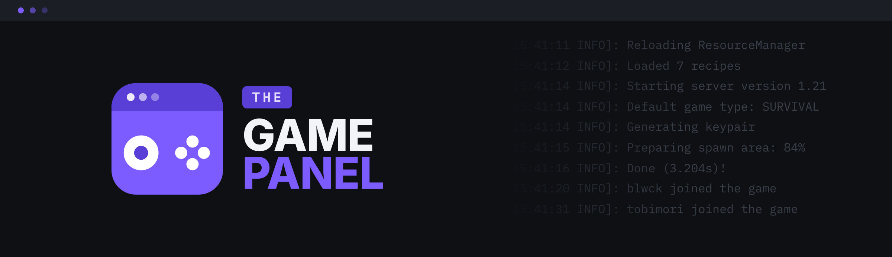

# The Game Panel

## Open-source game server management

Everything lives here: the `Engine\` layer providing the foundational architecture, the modules built on top of it,
the worker entry point, and the build that produces the single binary. Third-party modules extend the panel through
the same module system the first-party features are built on.

The panel ships as one binary running FrankenPHP in worker mode with Caddy underneath. The frontend is server-rendered
HTML with hypermedia interactions.

> [!NOTE]
> Pre-1.0 and under active development. What exists today is the dependency injection container, the config component
> (TOML with env interpolation), the database layer (connections, query builder and schema), and the value casting
> helpers. The HTTP layer, boot pipeline, module system, and the concepts around contexts, roles and permissions are
> all roadmap rather than shipped.
